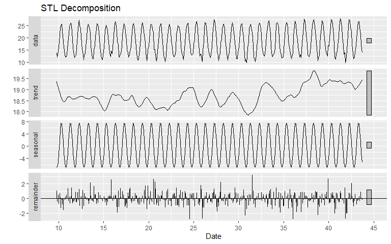
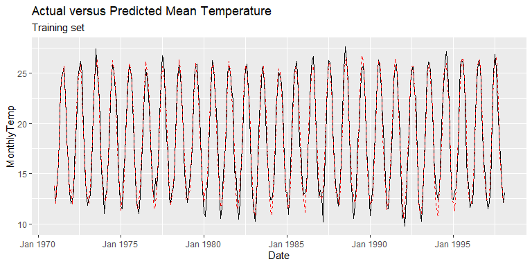
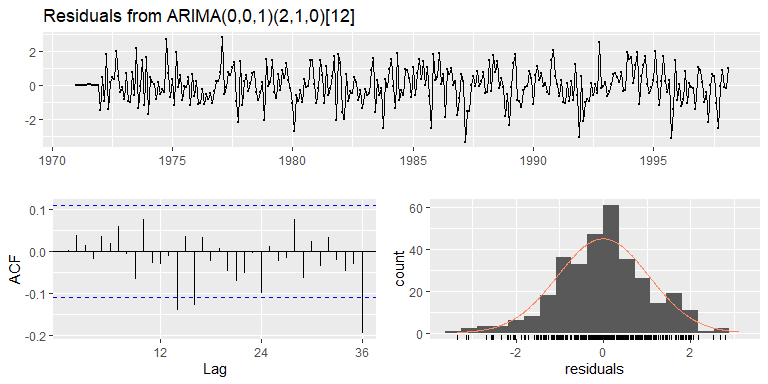
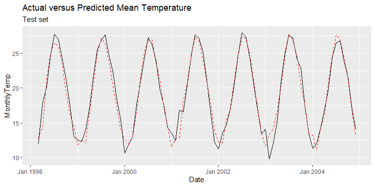

Time Series Forecasting with Applications in R
================
Kostas Mammas - email <komammas@microsoft.com>

## Introduction to time series

Time series are analyzed to understand the past and predict the future
enabling decision makers to make informed decisions. They are used in
everyday operational decisions across numerous industries, including,
finance, the environment .

In this workshop we will go through some basic concepts of statistical
forecasting, starting from stationary and extending our journey to
non-stationary time series using `R`.

## Loading and visualizing time series data

``` r
# Load required libraries
source("R/load_lib.R")

using("data.table", "ggplot2", "forecast","MLmetrics","gridExtra","tseries","zoo","lubridate")
```

    ## Loading required package: data.table

    ## Loading required package: ggplot2

    ## Loading required package: forecast

    ## Registered S3 method overwritten by 'quantmod':
    ##   method            from
    ##   as.zoo.data.frame zoo

    ## Loading required package: MLmetrics

    ## 
    ## Attaching package: 'MLmetrics'

    ## The following object is masked from 'package:base':
    ## 
    ##     Recall

    ## Loading required package: gridExtra

    ## Loading required package: tseries

    ## Loading required package: zoo

    ## 
    ## Attaching package: 'zoo'

    ## The following objects are masked from 'package:base':
    ## 
    ##     as.Date, as.Date.numeric

    ## Loading required package: lubridate

    ## Warning: package 'lubridate' was built under R version 4.0.5

    ## 
    ## Attaching package: 'lubridate'

    ## The following objects are masked from 'package:data.table':
    ## 
    ##     hour, isoweek, mday, minute, month, quarter, second, wday, week,
    ##     yday, year

    ## The following objects are masked from 'package:base':
    ## 
    ##     date, intersect, setdiff, union

``` r
# Load data
dseries = fread("../data/TG_STAID000061.txt",sep = ",", skip = 20, header = T)

# Access top 6 records
head(dseries)
```

    ##    STAID SOUID     DATE  TG Q_TG
    ## 1:    61   232 19550101 131    0
    ## 2:    61   232 19550102 126    0
    ## 3:    61   232 19550103 118    0
    ## 4:    61   232 19550104 136    0
    ## 5:    61   232 19550105 139    0
    ## 6:    61   232 19550106 146    0

``` r
# Convert to date format
dseries[, DATE:= ymd(DATE)]

# Get Records with High Quality
dseries = dseries[year(DATE) > 1970 & year(DATE) < 2005]

# Convert the temperature to the right scale
dseries[, TG := 0.1*TG]

# Plot mean temperature
ggplot(data = dseries) + geom_line(aes(x = DATE, y = TG)) + xlab("Day") + ylab("Mean Temperature")
```


``` r
# Create summary statistics of the mean temperature series
dseries[, summary(TG)]
```

    ##    Min. 1st Qu.  Median    Mean 3rd Qu.    Max. 
    ##    2.50   13.90   18.40   18.76   24.00   37.50

``` r
# Generate summary statistics by month
dseries[, .(`Min Mean Temperature` = min(TG),
            `Max Mean Temperature` = max(TG),
            `SD Mean Temperature` = sd(TG)
            ), by = month(DATE)]
```

    ##     month Min Mean Temperature Max Mean Temperature SD Mean Temperature
    ##  1:     1                  3.1                 19.3            2.259278
    ##  2:     2                  2.5                 22.3            2.603703
    ##  3:     3                  2.8                 27.1            2.731832
    ##  4:     4                  8.4                 27.8            2.801875
    ##  5:     5                 13.6                 33.0            2.598023
    ##  6:     6                 17.2                 33.1            2.321201
    ##  7:     7                 20.2                 37.5            1.727732
    ##  8:     8                 22.2                 36.1            1.475579
    ##  9:     9                 16.0                 31.8            1.840926
    ## 10:    10                 13.1                 31.6            2.692787
    ## 11:    11                  8.9                 27.6            2.543154
    ## 12:    12                  4.8                 21.6            2.315821

``` r
# Create box plots for each month
ggplot(data = dseries) +
  geom_boxplot(aes(x = factor(month(DATE)), y = TG)) +
  xlab("Month") +
  ylab("Mean Temperature")
```


``` r
# Create box plots per year
ggplot(data = dseries) +
  geom_boxplot(aes(x = factor(year(DATE)), y = TG)) +
  xlab("Month") +
  ylab("Mean Temperature") +
  theme(axis.text.x = element_text(angle = 90, vjust = 0.5, hjust=1))
```


``` r
monthlySeries = copy(dseries[, .(MonthlyTemp = mean(TG)), by = .(Date = as.yearmon(DATE))])
ggplot(data = monthlySeries) +
  geom_line(aes(x = Date, y = MonthlyTemp)) +
  xlab("Date") +
  ylab("Monthly Temperature")
```


## Stationary Time Series

A stationary time series is one whose properties do not depend on time
at which time series is observed. Thus, time series with trends, or
seasonality are not stationary, the trend and seasonality will affect
the value of the time series at different times.

In general, stationary time series will not have predictable patterns in
the long term. Time plots will show the series to be roughly horizontal
(cyclic behavior is possible), with constant variance.


Obvious seasonality rules out series (d), (h) and (i). Trends and
changing levels rules out series (a), (c), (e), (f) and (i). Increasing
variance also rules out (i). That leaves only (b) and (g) as stationary
series.

### Definition: Strictly Stationary

We represent a time series of length *n* by
{*x*<sub>*t*</sub> : *t* = 1, ..., *n*} = {*x*<sub>1</sub>, *x*<sub>2</sub>, ..., *x*<sub>*n*</sub>}.
It consists of *n* values sampled at discrete times 1, 2, ..., *n*.
Strictly stationary is a time series for which the probabilistic
behavior of every collection of values
*x*<sub>1</sub>, *x*<sub>2</sub>, ..., *x*<sub>*n*</sub> is identical to
that of the time shifted set
*x*<sub>1 + *h*</sub>, *x*<sub>2 + *h*</sub>, ..., *x*<sub>*n* + *h*</sub>.
That is:

*P**r*{*x*<sub>1</sub> ≤ *c*\_1, ..., *x*<sub>*n*</sub> ≤ *c*<sub>*n*</sub>} = *P**r*{*x*<sub>1 + *h*</sub> ≤ *c*<sub>1</sub>, ..., *x*<sub>*n* + *h*</sub> ≤ *c*<sub>*n*</sub>}

### Definition: Weakly Stationary

A weakly stationary time series *x*<sub>*t*</sub> is a finite variance
process such that:

1.  The mean value function *μ*<sub>*t*</sub> is constant and does not
    depend on time *t*, and
2.  The autocovariance function depends on *s* and *t* only through
    their difference *s* − *t*:

*γ*<sub>*x*</sub>(*s*, *t*) = *c**o**v*(*x*<sub>*s*</sub>, *x*<sub>*t*</sub>) = *E*\[(*x*<sub>*s*</sub> − *μ*<sub>*s*</sub>)(*x*<sub>*t*</sub> − *μ*<sub>*s**t*</sub>)\]

for all *S* and *t*. The autocovariance measures the linear dependence
between two points on the same series observed at different times.

## Differencing

One way of conrting non stationary time series stationary, is by
differencing. This requires computing the differences between
consecutive observations.

## Time Series Decomposition

Time series exhibit a variety of patterns and it is often helpful to
split the time series into three different components (trend,
seasonality and cycles).

Many time series are dominated by a trend and/ or seasonal effects. A
simple *additive decomposition* model is given by:

*x*<sub>*t*</sub> = *m*<sub>*t*</sub> + *s*<sub>*t*</sub> + *z*<sub>*t*</sub>

where at time *t*, *x*\_*t* is the observed series, *m*\_*t* is the
trend, *s*\_*t* is the seasonal effect and *z*\_*t* is an error term
that is a sequence of correlated random variables with mean equal to
zero.

If the seasonal effects tend to increase as the trend increases as well,
a *multiplicative* model may be more appropriate:

*x*<sub>*t*</sub> = *m*<sub>*t*</sub> × *s*<sub>*t*</sub> + *z*<sub>*t*</sub>

### Classical decomposition

``` r
# Convert mean temperature to time series object
tseries = ts(monthlySeries[, MonthlyTemp],frequency = 12, start = monthlySeries[,min(MonthlyTemp)])

# Perform classical additive time series decomposition
autoplot(decompose(tseries, type = "additive")) +xlab("Date")
```


### LOESS Time Series Decomposition

``` r
autoplot(stl(tseries,s.window="periodic", robust=TRUE)) +xlab("Date") + ggtitle("STL Decomposition") + xlab("Date")
```



**Autocorrelation**: It indicates the correlation of the time series
with prior time steps and provides information around two different
aspects of the time series:

1.  It shows whether the lagged values of the time series influence the
    current step
2.  It provides information around the stationarity of the time series.
    A non-stationary time series has autocorrelation lags that fall to
    zero very quickly.

It is clear from the autocorrelation plot that the lags of the mean
temperature are statistically significant, therefore they lead to the
conclusion that the mean temperature series are highly correlated.

**Partial autocorrelation**: Is the correlation between the correlation
of the time series with prior time steps with the relationships of the
intervening observations removed.

``` r
# Check autocorrelation in time series
gridExtra::grid.arrange(
  ggAcf(tseries) + ggtitle("Autocorrelation plot"),
  ggPacf(tseries) + ggtitle("Partial autocorrelation plot")
)
```


In this graph we can see that the strongest positive correlation comes
at lag 12, which arises after a period of negatively correlated lags
between 3 and 7. The partial autocorrelation plot shows a correlation at
lag 1 which implies that the model follows an AR(1) process.

## Forecasting and Model Selection (Statistical Approach)

In this section, we go through the

We split the time series data into training and test. The training set
is used to train the model using a set of hyper-parameters and the test
set is used to validate the performance of the selected hyper-parameters
test set.


The training set will be used primarily to understand the time series
and their characteristics. We don’t want to learn the characteristics of
the time series in the test set as this will violate the learning
process and will induce information leakage in the training set.

When limited data is available, which is quite common in time series
forecasting applications, multiple models are fitted in the training
set, the best model is selected using the AIC or the BIC criterion and
the best model is evaluated in the test set.

``` r
# Obtain the training set only
train_ratio = 0.8
test_ratio  = 0.2

monthlySeries[1:round(train_ratio*.N), Status := "Train"]
monthlySeries[(round(train_ratio*.N)+1) : .N, Status := "Test"]

# Convert to time series object
tseries = ts(monthlySeries[Status == "Train",MonthlyTemp], start  = monthlySeries[Status == "Train",min(Date)], frequency = 12)
# Decompose time series
decomp  = stl(tseries, s.window = "periodic")

# Plot decomposed time series using LOESS
autoplot(decomp)
```


### **Stationarity Tests**

Before fitting forecasting models, it is critical to check the
stationarity of the time series. Two stationarity checks are described:

#### KPSS Test:

``` r
kpss.test(x = tseries)
```

    ## Warning in kpss.test(x = tseries): p-value greater than printed p-value

    ## 
    ##  KPSS Test for Level Stationarity
    ## 
    ## data:  tseries
    ## KPSS Level = 0.0052238, Truncation lag parameter = 5, p-value = 0.1

According to the results of the \`KPSS\` test, we fail to reject the
null hypothesis (series is stationary) and therefore the series is
stationary.

#### ADF-Test:

``` r
# Perfroming adf test
adf.test(x = tseries)
```

    ## Warning in adf.test(x = tseries): p-value smaller than printed p-value

    ## 
    ##  Augmented Dickey-Fuller Test
    ## 
    ## data:  tseries
    ## Dickey-Fuller = -15.652, Lag order = 6, p-value = 0.01
    ## alternative hypothesis: stationary

According to the results of the ADF test, we reject the null hypothesis
(series is non stationary) and therefore the series is stationary.

``` r
# Check autocorrelation in time series
gridExtra::grid.arrange(
  ggAcf(tseries, lag.max = 36) + ggtitle("Autocorrelation plot"),
  ggPacf(tseries, lag.max = 36) + ggtitle("Partial autocorrelation plot")
)
```


``` r
# Check autocorrelation in time series
ggtsdisplay(diff(tseries, lag = 12))
```


### Quick Introduction to ARIMA

An ARIMA model a class of statistical models for analyzing and
forecasting time series data. ARIMA is an acronym that stands for
Autoregressive Integrated Moving Average.

-   **AR**: Uses the relationship between an observation and some number
    of lagged observations
-   **I**: It relates to differencing observations by subtracting an
    observation by an observation in the previous step
-   **MA**: Uses the dependency between an observation and residual
    errors from a moving average applied to lagged observations.

A standard notion is used of ARIMA(p,d,q) where the parameters are
substituted by integer values to quickly specify the type of ARIMA model
being used.

The parameters of the ARIMA model are defined as follows:

-   **p**: the number of lag observations
-   **d**: the degree of differencing
-   **q**: the size of the moving average window

### Forecasting Mean Monthly Temperature using ARIMA

``` r
# Fit an auto arima in the training set
# Since the time series is stationary, the differencing factor will be set to 0
model = auto.arima(y = tseries, d = 0, max.p = 8, max.q = 6, seasonal = T, max.P = 6, max.Q = 6, D = 1, allowdrift=F, ic="bic", trace = FALSE)
summary(model)
```

    ## Series: tseries 
    ## ARIMA(0,0,1)(2,1,0)[12] 
    ## 
    ## Coefficients:
    ##          ma1     sar1     sar2
    ##       0.1770  -0.5242  -0.2748
    ## s.e.  0.0548   0.0555   0.0560
    ## 
    ## sigma^2 estimated as 1.139:  log likelihood=-466.57
    ## AIC=941.14   AICc=941.27   BIC=956.14
    ## 
    ## Training set error measures:
    ##                        ME     RMSE       MAE        MPE     MAPE      MASE
    ## Training set -0.004776482 1.042494 0.7989874 -0.3968805 4.850573 0.8163231
    ##                     ACF1
    ## Training set 0.001948064

``` r
# Obtain fitted values
pred_train = model$fitted

# Obtain the mean temperature values in the training + the model predicted values in the training set
train_performance = copy(monthlySeries[Status == "Train", .(Date, MonthlyTemp)])
train_performance[, Predicted := pred_train]

# Plot actual versus predicted series in the training set
ggplot(data = train_performance) +
  geom_line(aes(x = Date, y = MonthlyTemp)) +
  geom_line(aes(x = Date, y = Predicted), color = "red", linetype = "dashed") +
  ggtitle("Actual versus Predicted Mean Temperature","Training set")
```



#### Model diagnostic checking

``` r
checkresiduals(model)
```



    ## 
    ##  Ljung-Box test
    ## 
    ## data:  Residuals from ARIMA(0,0,1)(2,1,0)[12]
    ## Q* = 27.083, df = 21, p-value = 0.1681
    ## 
    ## Model df: 3.   Total lags used: 24

``` r
# Perform Box-Pierce and Ljung-Box Tests
Box.test(model$residuals,lag=10, fitdf=0, type="Lj")
```

    ## 
    ##  Box-Ljung test
    ## 
    ## data:  model$residuals
    ## X-squared = 5.8775, df = 10, p-value = 0.8254

#### Evaluate model performance in the test set

``` r
# Perform walk forward validation in the validation set
stepsAhead = 1
monthlySeries[, id := 1:.N]

# Define the start/ end point of walk forward validation
startingPoint = monthlySeries[Status == "Test", min(id)-stepsAhead]
endPoint = monthlySeries[Status == "Test", max(id)-stepsAhead]

# Loop over each time step
pred_valid = c()
for (i in startingPoint:endPoint){
  # Get time series object
  dseriesupd = monthlySeries[1:i, ts(data = MonthlyTemp,
                               start = min(Date),  
                               frequency = 12
                               )
                       ]
  
  # Update the model with the most updated data
  updatedModel = Arima(dseriesupd, model = model)
  
  # Store model predictions
  pred_valid = c(pred_valid,predict(updatedModel, n.ahead = stepsAhead)[["pred"]][[1]])
}

# Obtain the mean temperature values in the training + the model predicted values in the training set
valid_performance = copy(monthlySeries[Status == "Test", .(Date, MonthlyTemp)])
valid_performance[, Predicted := pred_valid]

# Plot actual versus predicted series in the training set
ggplot(data = valid_performance) +
  geom_line(aes(x = Date, y = MonthlyTemp)) +
  geom_line(aes(x = Date, y = Predicted), color = "red", linetype = "dashed") +
  ggtitle("Actual versus Predicted Mean Temperature","Test set")
```


