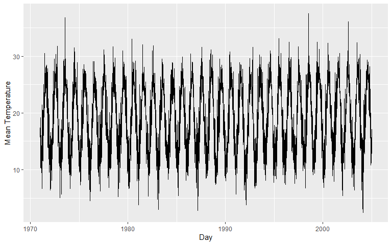
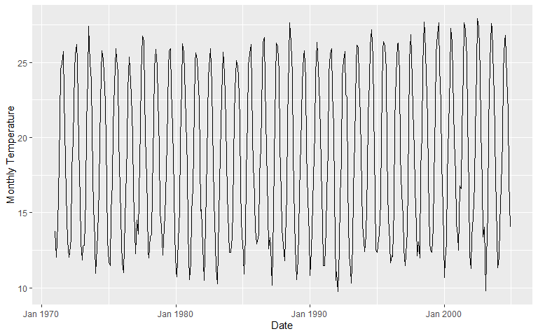
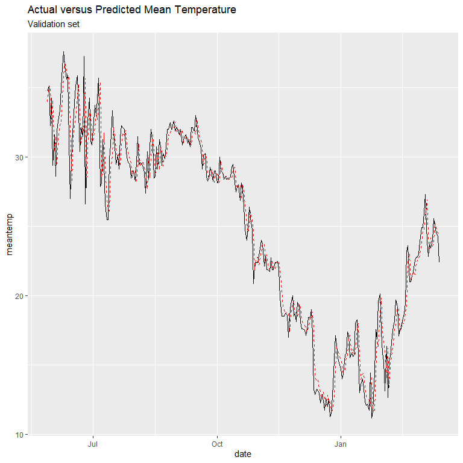

Time Series Forecasting with Applications in R
================
Kostas Mammas - email <komammas@microsoft.com>

## Introduction to time series

Time series are analyzed to understand the past and predict the future
enabling decision makers to make informed decisions. They are used in
everyday operational decisions across numerous industries, including,
finance, the environment .

In this workshop we will go through some basic concepts of statistical
forecasting, starting from stationary and extending our journey to
non-stationary time series using `R`.

## Loading and visualizing time series data

``` r
# Load required libraries
source("R/load_lib.R")

using("data.table", "ggplot2", "forecast","MLmetrics","gridExtra","tseries")
```

    ## Loading required package: data.table

    ## Loading required package: ggplot2

    ## Loading required package: forecast

    ## Registered S3 method overwritten by 'quantmod':
    ##   method            from
    ##   as.zoo.data.frame zoo

    ## Loading required package: MLmetrics

    ## 
    ## Attaching package: 'MLmetrics'

    ## The following object is masked from 'package:base':
    ## 
    ##     Recall

    ## Loading required package: gridExtra

    ## Loading required package: tseries

``` r
# Load data
dseries = fread("../data/DailyDelhiClimateTrain.csv",sep = ",")

# Access top 6 records
head(dseries)
```

    ##          date  meantemp humidity wind_speed meanpressure
    ## 1: 2013-01-01 10.000000 84.50000   0.000000     1015.667
    ## 2: 2013-01-02  7.400000 92.00000   2.980000     1017.800
    ## 3: 2013-01-03  7.166667 87.00000   4.633333     1018.667
    ## 4: 2013-01-04  8.666667 71.33333   1.233333     1017.167
    ## 5: 2013-01-05  6.000000 86.83333   3.700000     1016.500
    ## 6: 2013-01-06  7.000000 82.80000   1.480000     1018.000

``` r
# Convert to date format
dseries[, date := as.Date(date, format = "%Y-%m-%d")]

# Plot mean temperature
ggplot(data = dseries) + geom_line(aes(x = date, y = meantemp)) + xlab("Day") + ylab("Mean Temperature")
```



``` r
# Create summary statistics of the mean temperature series
dseries[, summary(meantemp)]
```

    ##    Min. 1st Qu.  Median    Mean 3rd Qu.    Max. 
    ##    6.00   18.86   27.71   25.50   31.31   38.71

``` r
# Generate summary statistics by month
dseries[, .(`Min Mean Temperature` = min(meantemp),
            `Max Mean Temperature` = max(meantemp),
            `SD Mean Temperature` = sd(meantemp)
            ), by = month(date)]
```

    ##     month Min Mean Temperature Max Mean Temperature SD Mean Temperature
    ##  1:     1              6.00000             20.14286            2.465232
    ##  2:     2             12.37500             23.87500            2.916742
    ##  3:     3             16.12500             30.00000            3.255996
    ##  4:     4             21.00000             35.68750            3.006285
    ##  5:     5             25.25000             38.71429            2.789445
    ##  6:     6             26.62500             38.50000            2.702637
    ##  7:     7             25.50000             36.62500            2.192400
    ##  8:     8             26.60000             34.12500            1.779262
    ##  9:     9             25.20000             33.44444            1.514612
    ## 10:    10             20.87500             33.26923            2.642065
    ## 11:    11             15.57143             25.64000            2.431649
    ## 12:    12              9.00000             25.00000            3.134796

``` r
# Create box plots for each month
dseries[, month := month(date)]
ggplot(data = dseries) +
  geom_boxplot(aes(x = factor(month(date)), y = meantemp)) +
  xlab("Month") +
  ylab("Mean Temperature")
```


``` r
# Create box plots per year
# dseries[, month := month(date)]
ggplot(data = dseries) +
  geom_boxplot(aes(x = factor(month(date)), y = meantemp)) +
  xlab("Month") +
  ylab("Mean Temperature") + facet_grid(~year(date))
```


## Stationary Time Series

A stationary time series is one whose properties do not depend on time
at which time series is observed. Thus, time series with trends, or
seasonality are not stationary, the trend and seasonality will affect
the value of the time series at different times.

In general, stationary time series will not have predictable patterns in
the long term. Time plots will show the series to be roughly horizontal
(cyclic behavior is possible), with constant variance.


Obvious seasonality rules out series (d), (h) and (i). Trends and
changing levels rules out series (a), (c), (e), (f) and (i). Increasing
variance also rules out (i). That leaves only (b) and (g) as stationary
series.

### Definition: Strictly Stationary

We represent a time series of length *n* by
{*x*<sub>*t*</sub> : *t* = 1, ..., *n*} = {*x*<sub>1</sub>, *x*<sub>2</sub>, ..., *x*<sub>*n*</sub>}.
It consists of *n* values sampled at discrete times 1, 2, ..., *n*.
Strictly stationary is a time series for which the probabilistic
behavior of every collection of values
*x*<sub>1</sub>, *x*<sub>2</sub>, ..., *x*<sub>*n*</sub> is identical to
that of the time shifted set
*x*<sub>1 + *h*</sub>, *x*<sub>2 + *h*</sub>, ..., *x*<sub>*n* + *h*</sub>.
That is:

*P**r*{*x*<sub>1</sub> ≤ *c*\_1, ..., *x*<sub>*n*</sub> ≤ *c*<sub>*n*</sub>} = *P**r*{*x*<sub>1 + *h*</sub> ≤ *c*<sub>1</sub>, ..., *x*<sub>*n* + *h*</sub> ≤ *c*<sub>*n*</sub>}

### Definition: Weakly Stationary

A weakly stationary time series *x*<sub>*t*</sub> is a finite variance
process such that:

1.  The mean value function *μ*<sub>*t*</sub> is constant and does not
    depend on time *t*, and
2.  The autocovariance function depends on *s* and *t* only through
    their difference *s* − *t*:

*γ*<sub>*x*</sub>(*s*, *t*) = *c**o**v*(*x*<sub>*s*</sub>, *x*<sub>*t*</sub>) = *E*\[(*x*<sub>*s*</sub> − *μ*<sub>*s*</sub>)(*x*<sub>*t*</sub> − *μ*<sub>*s**t*</sub>)\]

for all *S* and *t*. The autocovariance measures the linear dependence
between two points on the same series observed at different times.

## Differencing

One way of conrting non stationary time series stationary, is by
differencing. This requires computing the differences between
consecutive observations.

## Time Series Decomposition

Time series exhibit a variety of patterns and it is often helpful to
split the time series into three different components (trend,
seasonality and cycles).

Many time series are dominated by a trend and/ or seasonal effects. A
simple *additive decomposition* model is given by:

*x*<sub>*t*</sub> = *m*<sub>*t*</sub> + *s*<sub>*t*</sub> + *z*<sub>*t*</sub>

where at time *t*, *x*\_*t* is the observed series, *m*\_*t* is the
trend, *s*\_*t* is the seasonal effect and *z*\_*t* is an error term
that is a sequence of correlated random variables with mean equal to
zero.

If the seasonal effects tend to increase as the trend increases as well,
a *multiplicative* model may be more appropriate:

*x*<sub>*t*</sub> = *m*<sub>*t*</sub> × *s*<sub>*t*</sub> + *z*<sub>*t*</sub>

### Classical decomposition

``` r
# Convert mean temperature to time series object
tseries = ts(dseries[, meantemp],frequency = 12, start = dseries[,min(date)])

# Perform classical addive time series decomposition
autoplot(decompose(tseries, type = "additive")) +xlab("Date")
```



### LOESS Time Series Decomposition

``` r
autoplot(stl(tseries,s.window="periodic", robust=TRUE)) +xlab("Date") + ggtitle("STL Decomposition") + xlab("Date")
```


**Autocorrelation**: It indicates the correlation of the time series
with prior time steps and provides information around two different
aspects of the time series:

1.  It shows whether the lagged values of the time series influence the
    current step
2.  It provides information around the stationarity of the time series.
    A non-stationary time series has autocorrelation lags that fall to
    zero very quickly.

It is clear from the autocorrelation plot that the lags of the mean
temperature are statistically significant, therefore they lead to the
conclusion that the mean temperature series are highly correlated**.**

**Partial autocorrelation**: Is the correlation between the correlation
of the time series with prior time steps with the relationships of the
intervening observations removed.

``` r
# Check autocorrelation in time series
gridExtra::grid.arrange(
  ggAcf(tseries) + ggtitle("Autocorrelation plot"),
  ggPacf(tseries) + ggtitle("Partial autocorrelation plot")
)
```


## Forecasting and Model Selection (Statistical Approach)

We split the time series data into training and test. The training set
is used to train the model using a set of hyper-parameters and the test
set is used to validate the performance of the selected hyper-parameters
test set.


The training set will be used primarily to understand the time series
and their characteristics. We don’t want to learn the characteristics of
the time series in the validation and test sets as this will violate the
learning process and will induce information leakage in the training
set.

When limited data is available, which is quite common in time series
forecasting applications, multiple models are fitted in the training
set, the best model is selected using the AIC or the BIC criterion and
the best model is evaluated in the test set. I

``` r
# Obtain the training set only
train_ratio = 0.8
test_ratio  = 0.2

train_data = copy(dseries[1:round(train_ratio*.N)])
test_data  = copy(dseries[(round(train_ratio*.N)+1) : .N])

# Convert to time series object
tseries = ts(train_data[,meantemp], start  = train_data[,min(date)], frequency = 12)
# Decompose time series
decomp  = stl(tseries, s.window = "periodic")

# Plot decomposed time series using LOESS
autoplot(decomp)
```


### **Stationarity Tests**

Before fitting forecasting models, it is critical to check the
stationarity of the time series. Two stationarity checks are described:

#### KPSS Test:

``` r
kpss.test(x = tseries)
```

    ## 
    ##  KPSS Test for Level Stationarity
    ## 
    ## data:  tseries
    ## KPSS Level = 0.41325, Truncation lag parameter = 7, p-value = 0.07144

According to the results of the \`KPSS\` test, we reject the null
hypothesis and therefore the series is stationary.

#### ADF-Test:

``` r
# Perfroming adf test
adf.test(x = tseries)
```

    ## 
    ##  Augmented Dickey-Fuller Test
    ## 
    ## data:  tseries
    ## Dickey-Fuller = -2.2603, Lag order = 10, p-value = 0.4681
    ## alternative hypothesis: stationary

According to the results of the ADF test, we fail to reject the null
hypothesis and therefore the series is stationary.

## Holt Winters

….

## Autoregressive Integrated Moving Average

In this section, we introduce a special family of the stochastic linear
models, the Autoregressive Integrated Moving Average (ARIMA).

### Model Training

``` r
# Function to split the dataset into training validation and test set
train_valid_test_split <- function(x, trainSplit, validSplit, testSplit){

  status <- rep(as.character(NA), times = length(x))
  trainSize <- round(trainSplit * length(x))
  validSize <- round(validSplit * length(x))
  testSize  <- round(testSplit * length(x))
  
  status[1:trainSize]                            <- "Train"
  status[(trainSize+1):(trainSize+validSize)]    <- "Validation"
  status[(trainSize+validSize+1):length(status)] <- "Test"
  
  return(status)
}

# Split the dataset into training (0.6), validation (0.2) and test (0.2) 
dseries[, Split := train_valid_test_split(date, 0.6, 0.2, 0.2)]
```

``` r
# Convert to time series object
tseries = ts(dseries[Split == "Train",meantemp], start  = train_data[,min(date)], frequency = 12)

# Fit an auto arima in the training set
model = auto.arima(y = tseries, d = 0, max.p = 6, max.q = 6)
summary(model)
```

    ## Series: tseries 
    ## ARIMA(4,0,0)(2,0,0)[12] with non-zero mean 
    ## 
    ## Coefficients:
    ##          ar1     ar2      ar3     ar4    sar1    sar2     mean
    ##       0.8078  0.0514  -0.0107  0.1371  0.0265  0.0166  24.1740
    ## s.e.  0.0335  0.0432   0.0434  0.0336  0.0349  0.0356   3.5706
    ## 
    ## sigma^2 estimated as 2.625:  log likelihood=-1665.79
    ## AIC=3347.58   AICc=3347.74   BIC=3385.79
    ## 
    ## Training set error measures:
    ##                      ME     RMSE      MAE        MPE     MAPE      MASE
    ## Training set 0.04073168 1.613728 1.252301 -0.3787666 5.692509 0.4476176
    ##                      ACF1
    ## Training set -0.005897599

``` r
# Obtain fitted values
pred_train = model$fitted

# Obtain the mean temperature values in the training + the model predicted values in the training set
train_performance = copy(dseries[Split == "Train", .(date, meantemp)])
train_performance[, Predicted := pred_train]

# Plot actual versus predicted series in the training set
ggplot(data = train_performance) +
  geom_line(aes(x = date, y = meantemp)) +
  geom_line(aes(x = date, y = Predicted), color = "red", linetype = "dashed") +
  ggtitle("Actual versus Predicted Mean Temperature","Training set")
```


``` r
# Model performance in the training set
train_performance[, .(MAPE = MLmetrics::MAPE(y_pred = meantemp, y_true = Predicted),
                    R2 = MLmetrics::R2_Score(y_pred = meantemp, y_true = Predicted),
                  RMSE = MLmetrics::RMSE(y_pred = meantemp, y_true = Predicted)
)
                  ]
```

    ##          MAPE       R2     RMSE
    ## 1: 0.05643136 0.952676 1.613728

#### Model Validation

In this step we perform model validation in the validation set. At each
step we update the model and predict the next step.

``` r
# Perform walk forward validation in the validation set
stepsAhead = 1
dseries[, id := 1:.N]

# Define the start/ end point of walk forward validation
startingPoint = dseries[Split == "Validation", min(id)-stepsAhead]
endPoint = dseries[Split == "Validation", max(id)-stepsAhead]

# Loop over each time step
pred_valid = c()
for (i in startingPoint:endPoint){
  # Get time series object
  dseriesupd = dseries[1:i, ts(data = meantemp,
                               start = min(date),  
                               frequency = 12
                               )
                       ]
  
  updatedModel = Arima(dseriesupd, model = model)
  pred_valid = c(pred_valid,predict(updatedModel, n.ahead = stepsAhead)[["pred"]][[1]])
}

# Obtain the mean temperature values in the training + the model predicted values in the training set
valid_performance = copy(dseries[Split == "Validation", .(date, meantemp)])
valid_performance[, Predicted := pred_valid]

# Plot actual versus predicted series in the training set
ggplot(data = valid_performance) +
  geom_line(aes(x = date, y = meantemp)) +
  geom_line(aes(x = date, y = Predicted), color = "red", linetype = "dashed") +
  ggtitle("Actual versus Predicted Mean Temperature","Validation set")
```



``` r
valid_performance[, .(MAPE = MLmetrics::MAPE(y_pred = meantemp, y_true = Predicted),
                    R2 = MLmetrics::R2_Score(y_pred = meantemp, y_true = Predicted),
                  RMSE = MLmetrics::RMSE(y_pred = meantemp, y_true = Predicted)
)
                  ]
```

    ##          MAPE       R2     RMSE
    ## 1: 0.04864736 0.944353 1.615875

#### A Machine Learning approach to train validate and test the ARIMA model

We split the time series data into training, validation and test. The
training set is used to train the model using a set of hyper-parameters,
the validation set is used to validate the performance of the selected
hyper-parameters in the validation set and the test set is used to test
the generalization capability of the model using unseen data.


#### A multivariate approach to time series forecasting using wavelet
